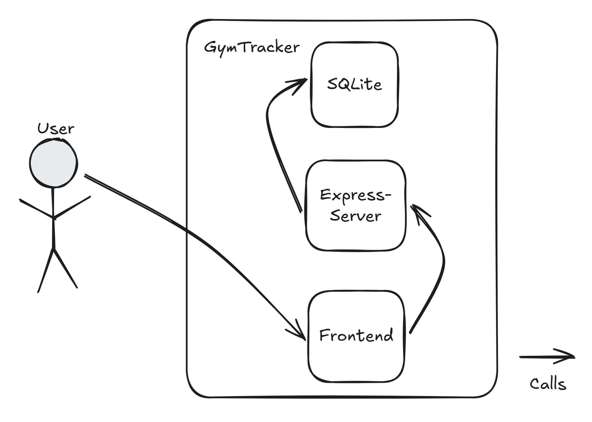
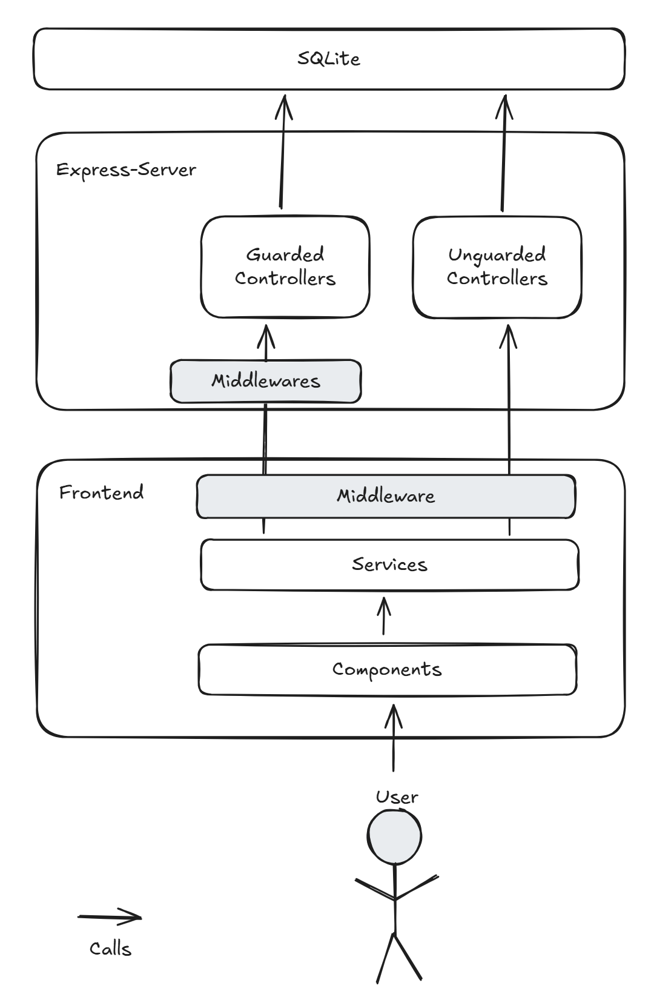
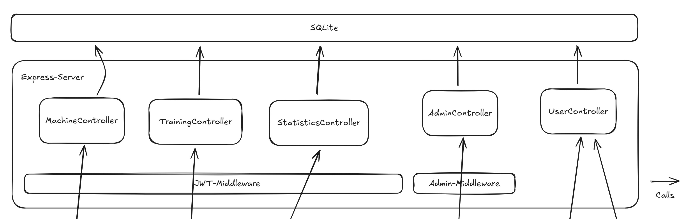
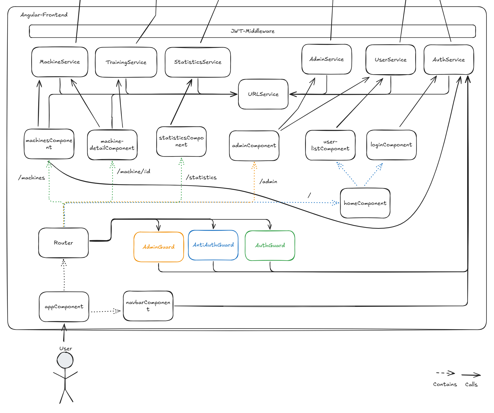
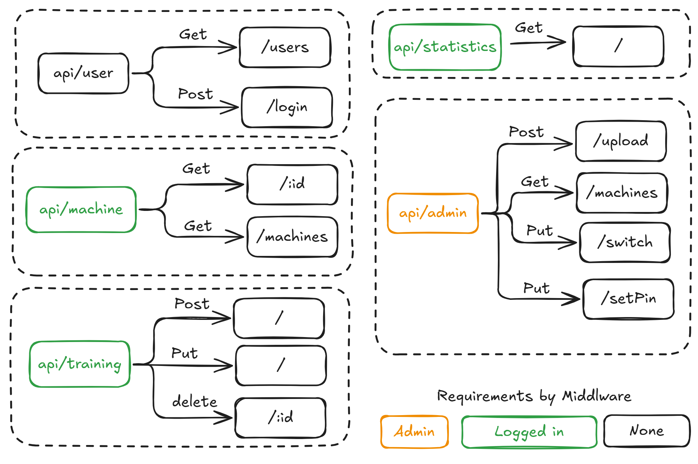
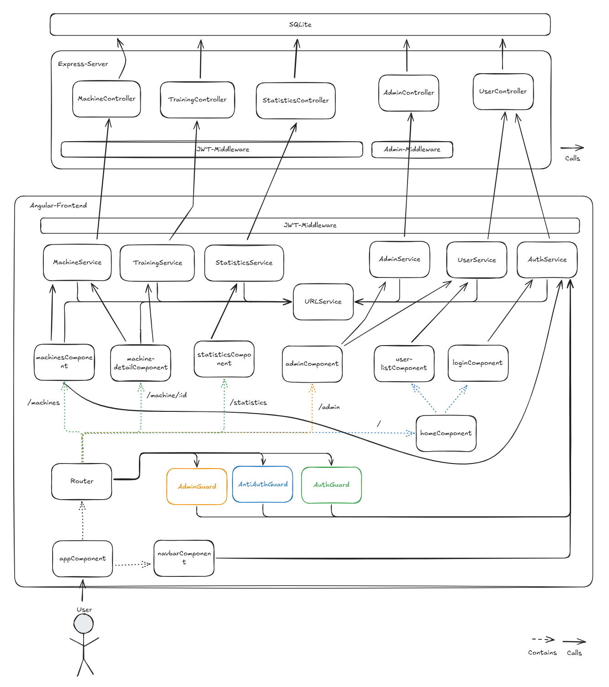

# GymTracker

Der «GymTracker» ist eine Applikation, welche einem hilft den Überblick beim Training im Gym zu Behalten. Bei einem Training ist es wichtig zu wissen welches Gewicht bei welcher Maschine zu wählen ist. Ausserdem hilft sie einem den Verlauf und Fortschritt der Trainings zu sehen.

Auf der Webseite kann man verschiedene Maschinen erfassen. Für jede Maschine kann man ein Training hinzufügen mit Kilos, Repetitionen für 3 Sets. Die Trainings kann man auch wieder 
Löschen oder Editieren.

Der selbst definierten Userstories können hier nachgelesen werden: [User Stories](Auftrag.md)  
Der Modul-Auftrag kann hier nachgelesen werden: [Auftrag Modul](https://github.com/web-programming-lab/web-programming-lab-projekt)

> Note: Diese Applikation ist nur für Mobile optimiert, daher ist im Browser auf dem PC der Developper-Mode zu empfehlen.

## Development server

Um das Backend zu starten, gehen sie zum [/Backend](./Backend/) folder und führen sie diese Befehle aus:

```bash
npm install
npm run dev
```

Um das frontend zu starten, führen sie die Folgenden befehle im [/Frontend](./Frontend/) folder auf:

```bash
npm install
ng serve --open
```

Sobald Front- und Back-end laufen kann die Webseite unter `http://localhost:4200/` erreicht werden.
*(Der `--open` parameter öffnet den Link automatisch)*

# Dokumentation

## Kontextabgrenzung

Die Folgenden Userstories wurden im Tahmen dieses Projektes umgesetzt. Eine detaillierte Beschreibung kann [HIER](Auftrag.md) gefunden werden.

| Nummer | User Story                       | Priority  | State|
| ------ | -------------------------------- | --------- | ---- |
| 1      | Maschinenübersicht               | MUST      | Done |
| 2      | Training erfassen                | MUST      | Done |
| 3      | Training bearbeiten              | MUST      | Done |
| 4      | Anmeldung & Benutzerverwaltung   | SHOULD    | Done |
| 5      | Administrator-Funktionalitäten   | SHOULD    | Done |
| 6      | Statistiken & Fortschrittsanalyse| COULD     | Done |

## Technischer Kontext
Das Projekt Gymtracker besteht aus einem Frontend gebaut in Angular 19 Standalone Components und einem Backend gebaut mit einem Express Server und geschrieben in Typescript. Die Persistierung wurde mittels SQLite Datenbank implementiert, anders als im Projektbeschrieb erwähnt. Diese Änderung wurde vollzogen, um das ganze Setup zu vereinfachen und weil eine Filebased DB für diesen Anwendungszweck genügend ausreicht.

Wie bereits erwähnt besteht die Webseite aus 3 Hauptkomponenten. Frontend Backend und SQLite Datenbank oder Datenbank File. Da die Applikation auf keine andere Endpoints oder Informationen angewiesen ist, ist der User die einzige Interaktion ausserhalb des Systems. 



## Technologieentscheidungen

### Frontend
Für das Frontend wurde Angular 19 mit Standalone-Components gewählt. Diese Entscheidung wurde durch den Unterricht und den Projektauftrag beeinflusst. Angular hat aber zusätzlich auch eine grosse Community, viele Hilfeforen und ist gut gewartet, sodass diese Entscheidung auch so auf Angular gefallen wär.

### UI
Für das UI wurde das DaisyUI Framework gewählt. Dieses Framework ist basierend auf Talwind und stellt all seine Funktionen zur Verfügung, sowie zusätzlich auch noch fertige eigene Komponenten. Diese beiden Frameworks ermöglichen ein sehr schnelles entwickeln und sorgen dafür, dass alle Komponenten stimmig miteinander zusammenpassen. Ausserdem ermöglichen sie Themes, was die Farbselektion vereinfacht.
Für die Icons wurden die Boxicon Icons verwendet da es eine grosse Auswahl an gratis Icons beinhaltet.

Da die Webseite später ausschliesslich auf dem Smartphone genutzt wird, wurde das Design nur auf Mobile optimeirt. Auf dem PC funktioniert alles und es gibt keine UI-Bugs, jedoch sind gewisse Pages nicht besonders stimmig auf einem grossen Bildschirm.  

### Backend
Für das Backend wurde ein Node.js Express Server verwendet, dies auch wieder, weil es teil des Unterrichtstoffes war aber auch da es ein sehr schnelles und einfaches Entwickeln in JS ermöglicht. Das Backend wurde ausserdem in TypeScript geschrieben, damit der Code im Front- und Backend möglichst ähnlich geschrieben werden kann.

### Authentifikation
Für die Authentifikation wurden die JWT Tokens gewählt, da dies heutzutage Standard ist und einem auf einfache Weise Rollenverteilung und ein vertrauenswürdiger Informationsfluss ins Frontend erlauben.

### Hashing
Für das Passworthashing wurde Bcrypt verwendet, da Bcrypt auch ein heutzutagiger Sicherheitsstandard ist und sehr simpel einzubinden ist. Bcypt gilt nach wie vor als eine sichere effiziente Option. Hier ist vielleicht die spezielle Handhabung von Passwörtern anzusprechen. Da die Applikation später effektiv im privaten genutzt werden soll, wurde entschieden, dass der Admin andere Passwörter zurücksetzen kann und die Benutzer keine wirkliche Benutzerverwaltung brauchen.

### Datenbank
Für die Datenbank wurde eine SQLite Datenbank genutzt. Da in dieser Applikation relativ wenig Daten geschrieben und gelesen werden und das meist nur von einem Benutzer, reicht SQLite vollkommen aus. Da die Applikation später auf einem NAS laufen wird, wurde geschaut, dass möglichst wenig Ressourcen dafür gebraucht werden, darum wurde anders wie in den Abgegebenen Requirements auf eine dockerisierte Postgres DB verzichtet.

### Testing
Fürs Testing wurde supertest verwendet, da damit ein E2E Test gemacht werden kann und somit auch das Routing überprüft werden kann, sowie das Authentifizieren mittels JWT Tokens.

## Bausteinsicht Stufe 2

Schauen wir ein Level genauer rein, sehen wir, dass gewisse Kommunikation zuerst durch Middlewares gehen und andere Kommunikation ohne sie zuerst anzuschauen direkt an die Controller geleitet wird. Beide Arten von Controllern werden jedoch schlussendes irgendwelche Informationen aus der Datenbank abfragen und sie anschliessend dem Caller als JSON wiedergeben, falls erlaubt.

Im Frontend wird der Call des Benutzers von einem Router an eine Angular Komponente geleitet. Diese bereitet dem User die abgefragten Daten aus den Services schön als HTML dar.

Die Services übernehmen die Kommunikation mit dem Backend. Bevor die einzelnen Requests jedoch an das Backend geschickt werden, werden sie durch eine Middleware geschickt, welche für die Authentifizierung im Backend gebraucht wird.



## Bausteinsicht 2. Stufe
Wirft man einen genaueren Blick auf das Backend, so sieht man die Aufteilung der Controller zwischen mit Middleware und ohne Middleware. Die Controller Machine, Training und Statistics werden alle durch die JWT Middleware geschützt. Sie schaut, ob das JWT Token vorhanden und gültig  ist. Ausserdem hängt sie das geparste Token dem Request an, sodass seine Daten im Controller genutzt werden können. (z.B User Id oder Rolle).

Der Admin Controller steht hinter der Admin middle ware, welche fast das Gleiche macht wie die Auth Middleware, nur dass der Benutzer die Adminrolle besitzen muss, damit er nicht ein 403 bekommt. Der User Controller steht hinter keiner Middleware, da er Endpoints für das Login selbst und für die Benutzerauswahl steht. Also Sachen, die Jeder requesten darf.

   

Auf der Frontendseite spiegeln sich die Controller grundsätzlich in den Services wider. Jeder Request, der von einem Service geschickt wird, geht durch die JWT-Middleware durch. Sie prüft ob der Benutzer momentan ein JWT Token besitzt und wenn ja, hängt sie es an den Header des Requests an.

Ein Service ist immer nur für einen Teilbereich verantwortlich (SR-Prinzip) und hat daher nur eine Abhängigkeit zum URL Service, welcher einfach die gebrauchten URLs zur Verfügung stellt.

 

### Komponenten
Macht ein User ein Request an die Webseite geht der Request zunächst an einen Router, welcher entscheid ob der User überhaupt und an welche Komponente gelangt. Dies entscheidet er Mittels Guards und Route-Definitions. Die gestrichelten Pfeile wurden anhand des verwendeten Guards eingefärbt. Sie Zeigen welche Komponenten von der darüberliegenden Komponente angezeigt werden können.  
Navbar wird immer angezeigt, hat aber selbst eine Abhängikeit zum Auth Service, da sie je nachdem ob der Benutzer eingeloggt ist oder nicht unterschiedliche Links darstellt.

### Backend Endpoints
Hier sieht man alle Endpoints mit ihrer Route, sammt Requirements ihrer Middleware. Die Endpoints erben die Requirements ihrers Hauptknotens.

 

## Gross-Übersicht
 

## Verteilungssicht

Die Verteilung ist in dieser Applikation bewusst sehr simpel gestaltet. Ist wird weder Dockerisierung noch auf vertikale / horizontale Skalierung gesetzt. 

Das Backend läuft standardmässig auf Port `8000` oder auf dem in der Umgebungsvariable `PORT` definierten Wert. Das Frontend wird auf Port `4200` ausgeführt. Damit das Backend Anfragen vom Frontend akzeptiert, wurden die CORS-Regeln so konfiguriert, dass Anfragen von `http://localhost:4200` erlaubt sind.

# Fazit

Anfangs Blockwoche hatte ich noch sehr wenig Erfahrung im Bereich Webentwicklung und hatte Respekt vor dem Projekt. Jedoch merkte ich während der Blockwoche schon, dass Angular sehr angenehm ist um damit zu arbeiten. Ich machte schnell Fortschritte und bei Unklarheiten während dem Projektteil war ChatGPT auch in der Lage mir es effektiv zu erklären. Ausserdem war ich erstaunt, wie schnell es geht einen Express Server aufzusetzen, auch mit JWT-Token. Ich konnte relativ schnell einen POC erstellen, mit einem funktionierendem End-to-End V-Cut, was mir Sicherheit gab.  

Eher Mühe hatte ich beim Erstellen der SQL-Querries, dass die Daten so zurückgegeben wurden, wie ich es erwartete. Ich denke, im nächsten Projekt werde ich ein ORM verwenden, um mir das Querryschreiben zu sparen. Im Projekt wurde ausserdem viel Zeit verwendet, um das UI einigermassen schön aussehen zu lassen, trotz UI-Libraries. Dies war ich mir aber schon im Voraus bewusst, da das ja wirklich Trainingssache ist und ohne die Libraries wäre es noch länger gegangen.

Anfangs des Projektes nahm ich mir wirklich Zeit, um zu überlegen, was für unterschiedliche Pages will ich haben und welche Daten will ich dort darstellen / abfragen. Als ich mir dann mehr oder weniger sicher war, wie die Pages aussehen mussten, konnte ich mir dann überlegen wie, sie zusammengehören und dementsprechend konnte ich die Services, End Points und SQL Schemas definieren. Dies funktionierte erstaunlich gut und verhinderte, dass ich grosse, zeitaufwändige Designänderungen durchführen musste. Es mussten zum Beispiel nur ein, zwei Änderungen an einzelnen Attributen der SQL-Schemas der Tabellen gemacht werden.

Zurückblickend war es eine spannende Blockwoche, bei der man viel gelernt hat, aber auch ein spannendes Projekt, bei dem man fast nochmals gleichviel gelernt und vor allem gefestigt hat. Ich bin jedoch immer noch überrascht, dass es doch relativ lange geht eine simple aber gute Webseite zu schreiben. Die 60h dachte ich sind viel zu viel Zeit, aber ich brauchte schlussendlich doch auch fast so lang.

# Arbeitsjournal

Das Arbeitsjournal wurde fortlaufend geführt und korelliert mit den [Commits](https://github.com/scholtyl/WEBLAB/commits/main/) im Repo. Die Description wurde so kompakt wie möglich aber mit allen wichtigen Punkten verfasst. 

|NR	| Day   	| Hours	|Short Description                                                                      |
| - | --------- | ----- | ------------------------------------------------------------------------------------- |
|1	| 04.02.2025|	4	|Ideenfindung, Grobkonzept Aufbau Webseite, Evaluation frontend frameworks, Userstories |
|2	| 05.02.2025|	3	|Setup Projekt template, Login und Userlist components erstellt                         |
|3	| 06.05.2025|	4	|Make Components dynamic with hardcoded services                                        |
|4	| 07.05.2025|	5	|Setup Backend, create vcut for user (noDB)                                             |
|5	| 10.02.2025|	3	|Setup DB, Implement user service for real, Login end to end implemented                |
|6	| 12.02.2025|	3	|Machines End to end, navigation authorisation, Machine detail view end to end          |
|7	| 13.02.2025|	5	|Deletion of Training End to End, Detailview CRUD End to End, Basic functionality done  |
|8	| 17.02.2025|	3	|Finish Admin Page End to End                                                           |
|9	| 19.02.2025|	5	|Statistics page + bug fixing                                                           |
|10	| 20.02.2025|	4	|Start with testing backend                                                             |
|11	| 21.02.2025|	3	|Tests                                                                                  |
|12	| 23.02.2025|	5	|Abschlussarbeiten & Doku                                                               |
|13	| 24.02.2025|	3	|Doku & Diagramme                                                                       |
|14	| ?     	|   2	|(Presentation preparation)                                                             |
|   | **Total** | **52**|                                                                                       |
